# All In One Engine

**Build 2D & 3D games — all in one engine.**

All In One Engine is a Roblox Studio-style IDE for building 2D and 3D games in Python and JavaScript.
Write code, see it run live in the browser at 60 FPS. Three engines in one IDE:
Pygame 2D, Three.js 3D, and experimental Zhitlow 3D.

Includes a built-in sprite asset library (134 sprites), 4 starter templates, real 3D editor
with Three.js viewport, custom play-test avatar, multiplayer via socket.io, one-click publishing
to itch.io / Crazy Games / GitHub Pages, and native installers for Linux / macOS / Chromebook.

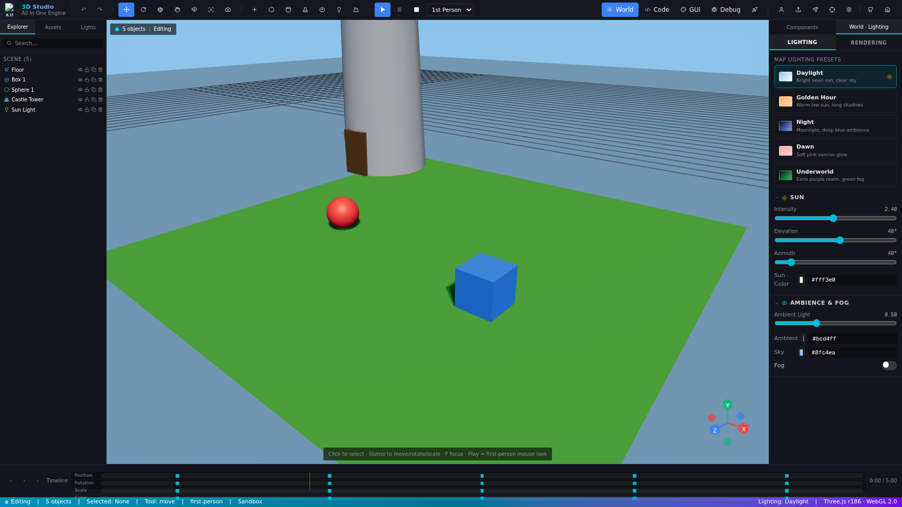

## Sprite Library (134 sprites)

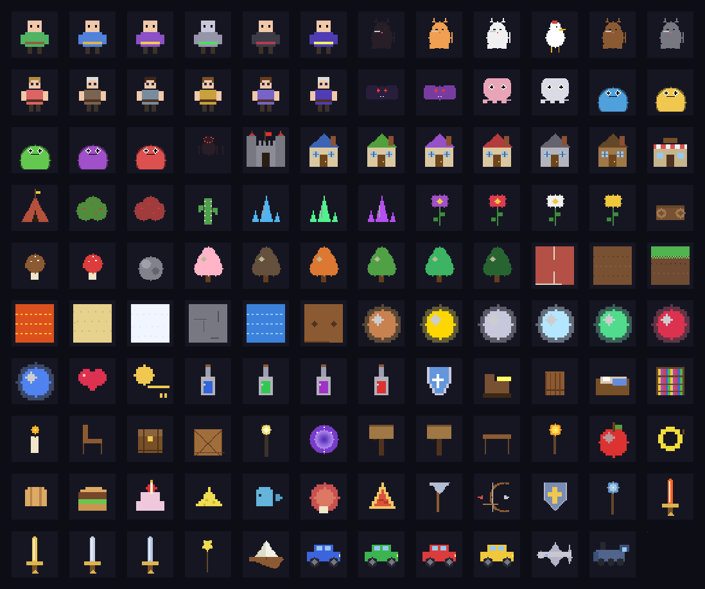

### By category

| | | |
|---|---|---|
| 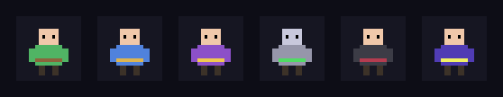 | 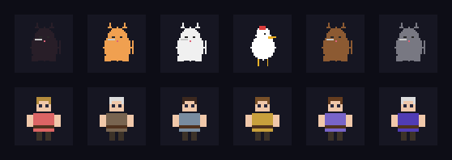 | 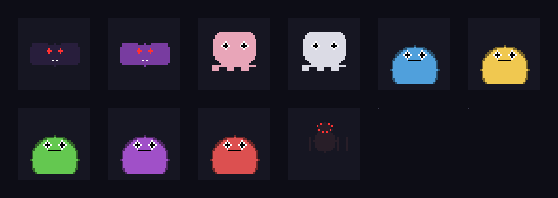 |
| 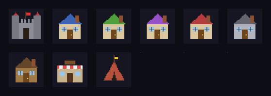 | 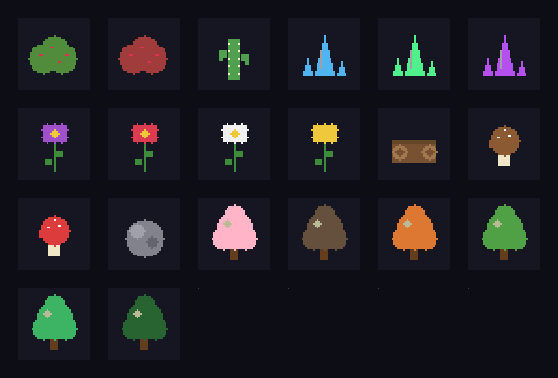 | 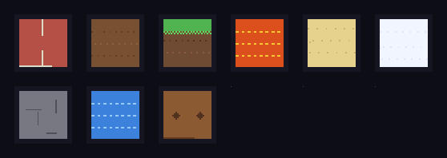 |
| 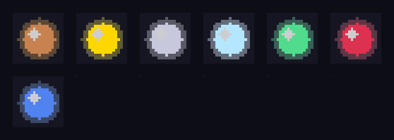 | 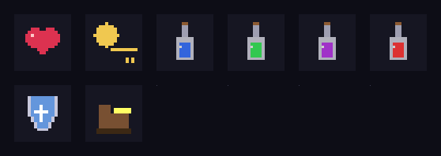 | 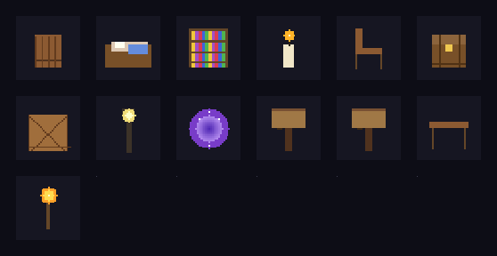 |
| 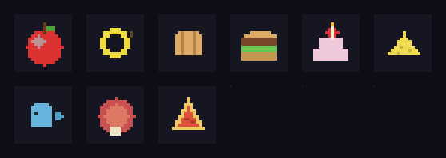 | 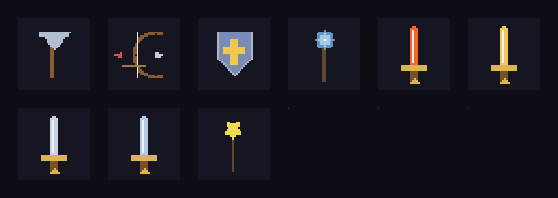 | 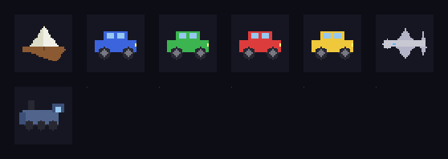 |

## What you get

### 1. Lapia Engine (`/engine`)

A MIT-licensed 2D game engine for Python, built on Pygame. ~50 well-built
core systems covering:

- **Rendering** — Sprite, Animation, Animator, Tilemap, ParticleSystem,
  Camera (with follow / deadzone / shake / zoom), Text, Primitive drawing,
  LayerManager, software Shaders (grayscale, vignette), 2D Lighting.
- **Physics** — PhysicsWorld with fixed timestep, RigidBody (static /
  kinematic / dynamic), AABB + circle colliders, friction + restitution,
  raycasting, joints (distance, spring), sleeping bodies.
- **Input** — Keyboard / Mouse / Gamepad / Touch, with action bindings
  ("jump" → [Space, W, Gamepad A]) and just-pressed / just-released deltas.
- **Audio** — AudioMixer with master / SFX / music channels, positional
  audio, programmatic sound generation (beep, noise), reverb / low-pass
  effects.
- **Scene / ECS** — Scene with full lifecycle, Entity with parent-child
  hierarchy, built-in Components (Transform, Sprite, RigidBody, Script,
  Lifetime, Tag), Scene manager with stack-based navigation, JSON
  serialization.
- **AI** — A* pathfinding with smoothing, flow fields, finite state
  machines, behavior trees (Sequence, Selector, Action, Condition, Wait,
  Inverter, Repeat), Reynolds steering behaviors, boid flocking.
- **Network** — TCP client / server stubs, message protocol, state sync
  with interpolation, in-memory leaderboard.
- **UI** — Widget system (Button, Label, Panel, Image, Slider, ProgressBar,
  Checkbox), layout helpers (vertical, horizontal, grid), themable colors.
- **Tooling** — Frame profiler, on-screen debug overlay, dev console with
  command registration, asset manager (images, sounds, fonts, JSON, sprite
  atlases), runtime object inspector.

[Read the engine README →](engine/README.md)

### 2. Lapia Studio IDE (`/src`)

A Roblox Studio-inspired web IDE built with Next.js 16 + TypeScript +
Tailwind CSS 4 + shadcn/ui. Features:

- **4-panel layout** — Explorer | Toolbox | Editor+Preview | Properties+Console (all resizable)
- **Monaco code editor** with Python syntax highlighting, multi-tab editing,
  autosave to localStorage, Ctrl+S to save, F5 to run.
- **Live preview** that actually runs your Python game in the browser via
  Pyodide + a custom canvas shim. Real-time at 60 FPS, with keyboard /
  mouse / gamepad input piped through. CRT-style scanline glow effect.
- **Asset Picker** — browse 55 built-in sprites (players, enemies, tiles,
  coins, power-ups, projectiles, particles, UI icons) organized by category.
  Click any sprite to copy paste-ready Python code to your clipboard.
- **Templates panel** — 4 starter templates you can load with one click:
  - **Platformer** — player movement, gravity, jumping, tilemap collision
  - **Top-Down Shooter** — player rotation, shooting, enemy spawning, particles
  - **Multiplayer Arena** — 2-4 player online arena via socket.io relay
  - **Physics Sandbox** — bouncing balls with gravity, walls, restitution
- **CSS editor** — styles the preview container around the canvas.
- **File Explorer** — tree view of all your project files.
- **Scene Hierarchy** — list of game objects in the current scene.
- **Properties panel** — inspect and edit entity properties live (numbers,
  booleans, colors, vectors).
- **Output console** — captures Python `print()` and exceptions with
  timestamps and severity coloring.
- **Status bar** — shows FPS, frame time, draw calls, entity count,
  Pyodide status, current file kind.
- **Top toolbar** — Play / Stop / Pause controls, view toggles for every
  panel, GitHub link.
- **Resizable panels** — drag handles to resize any panel.

### 3. Multiplayer Relay (`/mini-services/multiplayer-relay`)

A lightweight socket.io server (Bun + TypeScript) that relays player state
between browser sessions. Used by the Multiplayer Arena template.

- Protocol: `join` → `player_joined`, `state_update` (bidirectional), `player_left`
- Auto-cleanup of stale players (5s timeout)
- Up to 4 players per room
- CORS enabled for any origin
- Bound to `0.0.0.0:3001` so it's reachable from other machines on your LAN

Start it with: `./start-multiplayer.sh`

### 4. Demo Platformer

A complete platformer demo built with the engine showcasing:
- Sprite rendering with player + enemies + coins
- Tilemap collision
- Camera follow with smoothing
- Coyote time + jump buffering
- Enemy patrol AI
- Particle effects on jump and hit
- Score collection
- Live score HUD

## Quick start

### Run the IDE + multiplayer relay

```bash
bun install
./start-multiplayer.sh  # optional: starts socket.io relay on :3001
bun run dev
```

Then open http://localhost:3000.

### Run the Python engine standalone

```bash
cd engine
pip install -e .
python -m examples.platformer
```

Controls:
- Arrow keys / A,D — move
- Space / W / Up — jump
- F1 — toggle debug overlay
- F2 — toggle sprite bounds
- F3 — toggle grid
- ` (backtick) — open dev console

## Architecture

```
lapia-ai-agent/
├── engine/                    # Python/Pygame engine
│   ├── lapia/                  # The engine package
│   │   ├── __init__.py
│   │   ├── core.py             # Vector2/3, Color, Math, Clock, EventBus, Config
│   │   ├── rendering.py        # Sprite, Animation, Tilemap, Particles, Camera, ...
│   │   ├── physics.py          # PhysicsWorld, RigidBody, Collider, Joints
│   │   ├── input.py            # InputManager (keyboard/mouse/gamepad/touch)
│   │   ├── audio.py            # AudioMixer, Sound, Music
│   │   ├── scene.py            # Scene, Entity, Component, ECS
│   │   ├── ai.py               # Pathfinder, FSM, BehaviorTree, Steering
│   │   ├── network.py          # NetworkClient/Server, StateSync, Leaderboard
│   │   ├── ui.py               # Widgets, Layout, Theme
│   │   ├── tools.py            # Profiler, DebugOverlay, Console, AssetManager
│   │   └── engine.py           # Game class (main loop)
│   ├── examples/platformer.py
│   ├── tests/test_core.py
│   ├── setup.py
│   ├── pyproject.toml
│   ├── LICENSE
│   └── README.md
│
├── src/                        # Next.js Studio IDE
│   ├── app/                    # Next.js App Router
│   │   ├── page.tsx            # Main IDE layout (3-panel)
│   │   ├── layout.tsx
│   │   └── globals.css         # Roblox Studio dark theme
│   ├── components/ide/          # IDE components
│   │   ├── TopBar.tsx          # Studio ribbon (Play/Stop, menus, view toggles)
│   │   ├── FileExplorer.tsx    # File tree
│   │   ├── SceneHierarchy.tsx  # Scene entity tree
│   │   ├── PropertiesPanel.tsx # Live property editor
│   │   ├── CodeEditor.tsx      # Monaco editor wrapper
│   │   ├── EditorTabs.tsx      # Open file tabs
│   │   ├── PreviewPane.tsx     # Pyodide game preview canvas
│   │   ├── Console.tsx         # Python stdout/stderr console
│   │   └── StatusBar.tsx       # Bottom status bar
│   └── lib/
│       ├── studio-store.ts     # Zustand store (files, console, scene tree, ...)
│       └── pyodide-runner.ts   # Pyodide loader + lapia_shim Python module
│
├── public/                    # Static assets
├── prisma/                    # Prisma schema (DB, currently unused)
├── package.json
├── LICENSE                    # MIT
└── README.md                  # This file
```

## How the live preview works

The IDE ships a Python module called `lapia_shim` that mirrors the real
Python `lapia` engine API (Game, Scene, Sprite, Vector2, Color, Math,
InputManager, Camera, Renderer, Text). When you click Play:

1. The IDE loads Pyodide (the Python interpreter compiled to WebAssembly)
   from CDN.
2. It injects the `lapia_shim` module into Pyodide's virtual filesystem.
3. It executes your `main.py` via `exec()`.
4. Your code constructs a `Game(...)` instance, which registers itself
   globally so the JS host can drive it.
5. The JS host calls `game.run_frame(dt)` once per `requestAnimationFrame`,
   which advances the simulation and renders to an HTML `<canvas>` via JS
   bridge calls.

Because the `lapia_shim` API mirrors the real Python engine's API, your
code is portable — you can download the same `main.py`, drop it into the
`engine/examples/` folder, and run it with `python -m examples.your_file`
on your local machine.

## Tech stack

- **Next.js 16** (App Router, TypeScript)
- **Tailwind CSS 4** with custom Roblox Studio dark theme
- **shadcn/ui** component library
- **Monaco Editor** (the editor that powers VS Code)
- **Pyodide 0.26** (Python 3.12 compiled to WebAssembly)
- **Zustand** for state management (with persistence)
- **react-resizable-panels** for the draggable panel layout
- **lucide-react** for icons

## License

MIT — see [LICENSE](LICENSE).

## Contributing

1. Fork the repo
2. Create a feature branch (`git checkout -b feature/my-feature`)
3. Commit your changes (`git commit -am 'Add my feature'`)
4. Push to your fork (`git push origin feature/my-feature`)
5. Open a Pull Request
