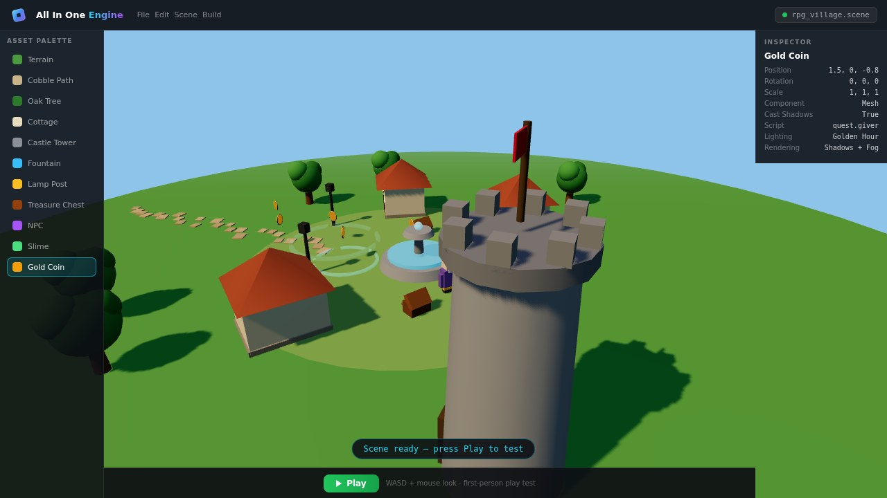

<div align="center">


# All In One Engine

### **Build 2D & 3D games — all in one engine.**

A **Roblox Studio-style IDE** that runs entirely in your browser.
Write **Python** or **JavaScript**, hit **Play**, and see your game run live at **60 FPS**.

[](https://gefrus112.github.io/all-in-onen-engine/)

[](LICENSE)
[](https://nextjs.org/)
[](https://www.python.org/)
[](https://threejs.org/)
[](https://pyodide.org/)
[](#-new-in-v34--ally-5-gets-a-face-a-brain-and-a-memory)
[](CONTRIBUTING.md)

**[🌐 Launch the IDE](https://gefrus112.github.io/all-in-onen-engine/)** · **[📖 Wiki](https://github.com/gefrus112/all-in-onen-engine/wiki)** · **[📦 Releases](https://github.com/gefrus112/all-in-onen-engine/releases)** · **[🐛 Report Bug](https://github.com/gefrus112/all-in-onen-engine/issues)**

</div>

<br />

[](https://gefrus112.github.io/all-in-onen-engine/)

[](https://github.com/gefrus112/all-in-onen-engine/raw/main/public/videos/rpg-build.mp4)

<p align="center"><i>🎬 <b>Showreel</b> — building and playing the RPG Village Quest inside 3D Studio (click to watch) · <a href="public/demo/rpg-build-demo.html">interactive demo</a></i></p>

<br />

## 🤖 NEW in v3.4 — Ally-5 gets a face, a brain and a memory

> **The AI Game Assistant is no longer "under development" — it's live in every Pygame studio.**

<div align="center">
  
  <p><sub><b>Ally</b> — the official Ally-5 mascot. She blinks, she floats, she smiles.</sub></p>
</div>

- **🥰 Her own avatar** — a custom cute smiling mascot (big glossy eyes, blush, antenna sparkle) now represents Ally everywhere: chat header, every message bubble, the model picker, the landing page and this README. It even blinks while you type.
- **📚 A real game-dev brain** — Ally trained on a **25-article curriculum (~4,500 words)**: collision detection, game loops & delta time, game feel/juice, screen shake, particles, difficulty curves, level design, color theory, boss design, platformer/shooter/top-down/roguelike recipes, optimization and playtesting. Ask *"how do I make a platformer feel good?"* or *"what is coyote time?"* and she teaches from it.
- **🧠 Reads huge code** — paste thousands of lines (or say *"analyze my code"*) and Ally maps the structure: classes, methods, engine hooks, sprites, imports and whether the game loop is wired correctly — plus diagnostics on top.
- **💭 Remembers you** — multi-turn conversation memory: your name, favorite colors, difficulty taste, last topics. Persisted in `localStorage`, so she says *"Welcome back"* after a reload. One click on the memory chip forgets everything.
- **Context windows per model** — every Ally-5 model now advertises its context: **Nano 16k → Fast 64k → Pro 128k → Max 256k → Game 200k**. Bigger models read bigger code.
- **5-model family** — switch between **Ally-5 Nano** (instant), **Fast** (quick builds), **Pro** (balanced · default), **Max** (deep thinking, extra particles & juice) and **Game** (tuned on game code only).
- **It builds & tunes games** — *"make a neon snake game called Voltage"*, *"build a space shooter"*, *"make it harder"*, *"add 25 coins"*, *"make it purple"* — Ally writes or rewrites a complete, playable `main.py`, 100% in your browser (no API keys, nothing leaves your machine).
- **Explains & debugs** — one-minute engine tour (Game / Scene / Sprite / Vector2 / Input), plus **static diagnostics** on your code (missing `game.run()`, wrong imports, `pygame.*` usage, hook typos) before you even press Run.
- **Built-in Terminal** — a real shell for the Pygame engine: `python main.py`, `ls`, `cat`, and **`pip install`** from the repo's own package registry (`lapia-kit`, `sfx-kit`, `particles-kit`…). Ally lives here too: `ally make me a pong`.
- **Packages on GitHub** — [`packages/`](packages) adds the Lapia engine package registry, desktop engine modules (`sprite_kit`, `sfx_kit`, `level_kit`, `particles_kit`, `ally_engine`) and the **Ally-5 knowledge base** (model card + training corpus + the full 25-article game-dev knowledge pack as JSON).
- **Real sprites in games** — new `load_image()` API: `Sprite(image=load_image("sprites/coins/coin_gold.png"))` loads actual bitmaps from the 134-sprite toolbox (with a magenta checker for missing paths). Fixed asset loading on GitHub Pages (basePath was breaking the toolbox manifest + icons).
- **🛡 Lapia Shield** — native browser DevTools are blocked site-wide (right-click, F12, view-source shortcuts) and the site now ships its **own working DevTools** (Elements inspector with live picker, Console, Page Source, Network) instead.

<br />

## 🆕 What's new in v3.1

- **First-person play test** — the Play button now locks your mouse into the game, true FPS-style. WASD + Shift to run, Space to jump, <kbd>Esc</kbd> releases the cursor. No more orbiting while you play-test.
- **Blender-style Components** — every object gets a component stack: Transform, Mesh Renderer, Rigid Body, Box Collider, Audio Source, Script, Particle Emitter, Network Sync. Add and remove them per object.
- **Map lighting presets** — one click switches the whole map: Daylight, Golden Hour, Night, Dawn or Underworld. Fine-tune sun elevation/azimuth, ambient color and fog.
- **Rendering settings** — shadows on/off, shadow map size, tone mapping (ACES/Linear/Reinhard), exposure, FOV, grid and gizmo toggles.
- **Real gizmos + new tools** — move/rotate/scale actually move objects now, with optional grid snapping, focus selection (<kbd>F</kbd>) and a one-click viewport screenshot.
- **3 new compound assets** — 🏰 Castle Tower, ⛲ Fountain, 💎 Treasure Chest (multi-part meshes, used across the RPG template).
- **Adjustable palette size** — the asset palette now resizes: S / M / L icon densities.
- **RPG Village Quest template** — a real, playable RPG built from the assets: collect 8 coins, open chests, talk to Elder Rowan, defeat 3 slimes. Quest HUD, health bar, dialogue boxes and sword combat included.

## 💡 What is this?

All In One Engine is a complete game development platform in a single browser tab. No installs, no accounts, no setup — click the link, pick an engine, and start building. It bundles **three game engines**, a **full code editor**, a **134-sprite asset library**, **multiplayer networking**, and **one-click publishing** behind one Roblox Studio-inspired interface.

It ships in five parts:

| | Part | What it is |
|---|---|---|
| 🎨 | **Lapia Studio IDE** (`/src`) | The web IDE — Monaco editor, live preview, 3D viewport, properties inspector |
| 🤖 | **Ally-5 + Packages** (`/packages`, `/src/lib/ally5*`) | Built-in AI game developer, terminal, and the engine package registry |
| ⚙️ | **Lapia Engine** (`/engine`) | A MIT-licensed 2D game engine for Python with ~50 core systems |
| 🌐 | **Multiplayer Relay** (`/mini-services`) | A socket.io relay server for real-time multiplayer |
| 📦 | **Build Scripts** (`/build_*.sh`) | Native installers: Linux AppImage, macOS .dmg, Chromebook .deb |

---

## 🎮 Three engines, one IDE

Pick your engine when you launch — or switch anytime:

| | 🔵 **Pygame 2D** | 🟣 **Three.js 3D** | 🟢 **Zhitlow 3D** *(beta)* |
|---|---|---|---|
| **Language** | Python 3.12 | JavaScript | Zhitlow Script |
| **Runtime** | Pyodide (WASM) | WebGL / Three.js r186 | Custom renderer |
| **Best for** | Sprite games, platformers, shooters | 3D worlds, meshes, lighting | Experimental open worlds |
| **Status** | ✅ Stable | ✅ Stable | 🧪 Experimental |
| **Highlights** | 134 sprites · physics · ECS · AI · CRT preview | FPS play-test · components · lighting presets · RPG template | Real gizmos · PBR materials · GUI editor |

---

## ✨ Everything you need to ship

| | Feature | Details |
|---|---|---|
| ✍️ | **Monaco Code Editor** | Python + JS syntax highlighting, multi-tab, autosave, Ctrl+S / F5 |
| 👁️ | **Live Preview** | Runs your Python game in-browser via Pyodide at 60 FPS with real input |
| 🧊 | **3D Studio** | Interactive Three.js viewport — gizmos, components, lighting presets, first-person play test, playable RPG template |
| 👥 | **Multiplayer** | Socket.io relay included — 2-4 players, real-time position sync |
| 🖼️ | **134+ Sprite Library** | 15 categories of pixel art — players, enemies, tiles, props, weapons |
| 📤 | **Asset Upload** | Drag in your own `.glb` `.gltf` `.wav` `.mp3` `.png` files |
| 🎵 | **Audio Editor** | Visual waveform editor — trim, fade, loop, mix |
| 🧍 | **Avatar Customizer** | 6 presets or build your own for play-test mode |
| 🔍 | **666+ Properties Panel** | Roblox Studio-style inspector with searchable, type-aware editors |
| 🚀 | **Publish Everywhere** | One-click export to itch.io, Crazy Games, GitHub Pages, or HTML5 |
| 🖥️ | **Native Builds** | Linux AppImage, macOS .dmg, Chromebook .deb, Windows .exe |

<details>
<summary><b>🎨 Sprite Library — 134 sprites across 15 categories</b></summary>


| | | |
|---|---|---|
|  |  |  |
|  |  |  |
|  |  |  |
|  |  |  |

</details>

---

## 🚀 Quick start

### Option A — Run in your browser (zero install)

> **[▶ Launch the IDE now](https://gefrus112.github.io/all-in-onen-engine/)**

That's it. Pick an engine, load a template, hit **Play**.

### Option B — Run locally

```bash
# 1. Clone
git clone https://github.com/gefrus112/all-in-onen-engine.git
cd all-in-onen-engine

# 2. Install dependencies
bun install          # or: npm install

# 3. (Optional) start the multiplayer relay on :3001
./start-multiplayer.sh

# 4. Launch the IDE
bun run dev          # → http://localhost:3000
```

### Run the Python engine standalone

```bash
cd engine
pip install -e .
python -m examples.platformer
```

<details>
<summary><b>⌨️ Demo controls</b></summary>

| Key | Action |
|---|---|
| `←` `→` / `A` `D` | Move |
| `Space` / `W` / `↑` | Jump |
| `F1` | Toggle debug overlay |
| `F2` | Toggle sprite bounds |
| `F3` | Toggle grid |
| `` ` `` | Open dev console |

</details>

---

## 🧰 Under the hood

<details>
<summary><b>⚙️ Lapia Engine — ~50 core systems (click to expand)</b></summary>

- **Rendering** — Sprite, Animation, Animator, Tilemap, ParticleSystem, Camera (follow / deadzone / shake / zoom), Text, primitives, LayerManager, software shaders (grayscale, vignette), 2D lighting
- **Physics** — fixed-timestep PhysicsWorld, RigidBody (static / kinematic / dynamic), AABB + circle colliders, friction + restitution, raycasting, distance & spring joints, sleeping bodies
- **Input** — Keyboard / Mouse / Gamepad / Touch with action bindings (`"jump"` → `[Space, W, Gamepad A]`) and just-pressed deltas
- **Audio** — AudioMixer with master / SFX / music channels, positional audio, programmatic sound generation, reverb / low-pass effects
- **Scene / ECS** — Scene lifecycle, Entity parent-child hierarchy, Components (Transform, Sprite, RigidBody, Script, Lifetime, Tag), stack-based scene navigation, JSON serialization
- **AI** — A* pathfinding with smoothing, flow fields, FSMs, behavior trees, Reynolds steering, boid flocking
- **Network** — TCP client / server, message protocol, state sync with interpolation, leaderboard
- **UI** — Widgets (Button, Label, Panel, Image, Slider, ProgressBar, Checkbox), layout helpers, themes
- **Tooling** — Frame profiler, debug overlay, dev console, asset manager, runtime inspector

📖 Full docs: [engine/README.md](engine/README.md)

</details>

<details>
<summary><b>🏗️ Architecture (click to expand)</b></summary>

```text
all-in-onen-engine/
├── engine/                    # Python/Pygame engine
│   ├── lapia/
│   │   ├── core.py            # Vector2/3, Color, Math, Clock, EventBus, Config
│   │   ├── rendering.py       # Sprite, Animation, Tilemap, Particles, Camera
│   │   ├── physics.py         # PhysicsWorld, RigidBody, Collider, Joints
│   │   ├── input.py           # InputManager (keyboard/mouse/gamepad/touch)
│   │   ├── audio.py           # AudioMixer, Sound, Music
│   │   ├── scene.py           # Scene, Entity, Component, ECS
│   │   ├── ai.py              # Pathfinder, FSM, BehaviorTree, Steering
│   │   ├── network.py         # NetworkClient/Server, StateSync, Leaderboard
│   │   ├── ui.py              # Widgets, Layout, Theme
│   │   ├── tools.py           # Profiler, DebugOverlay, Console, AssetManager
│   │   └── engine.py          # Game class (main loop)
│   ├── examples/platformer.py
│   └── tests/test_core.py
│
├── src/                       # Next.js Studio IDE
│   ├── app/                   # App Router (page.tsx, layout.tsx, globals.css)
│   ├── components/ide/        # TopBar, FileExplorer, SceneHierarchy,
│   │                          # PropertiesPanel, CodeEditor, PreviewPane,
│   │                          # Console, StatusBar, LandingPage, Studio3D
│   │   └── studio3d/          # 3D Studio modules: types, meshes, rpg runtime,
│   │                          # components/world panels, templates, canvas
│   └── lib/
│       ├── studio-store.ts    # Zustand store
│       └── pyodide-runner.ts  # Pyodide loader + lapia_shim module
│
├── mini-services/             # socket.io multiplayer relay (Bun)
├── public/                    # sprites, logos, videos (showreel), demo page
├── prisma/                    # DB schema (reserved)
└── build_*.sh                 # native installer build scripts
```

</details>

<details>
<summary><b>🔮 How the live preview works (click to expand)</b></summary>

The IDE ships a Python module called `lapia_shim` that mirrors the real `lapia` engine API. When you hit **Play**:

1. Pyodide (Python 3.12 compiled to WebAssembly) loads from CDN
2. The `lapia_shim` module is injected into Pyodide's virtual filesystem
3. Your `main.py` is executed via `exec()`
4. Your `Game(...)` instance registers globally so the JS host can drive it
5. Each `requestAnimationFrame`, the host calls `game.run_frame(dt)` — advancing the simulation and rendering to an HTML `<canvas>` via JS bridge calls

Because `lapia_shim` mirrors the real engine API, your code is **portable**: download `main.py`, drop it in `engine/examples/`, and run `python -m examples.your_file` locally.

</details>

---

## 🧪 Tech stack

| Layer | Tech |
|---|---|
| Framework | **Next.js 16** (App Router, TypeScript) |
| Styling | **Tailwind CSS 4** + **shadcn/ui** |
| Editor | **Monaco** (the editor behind VS Code) |
| Python runtime | **Pyodide 0.26** (CPython 3.12 → WebAssembly) |
| 3D | **Three.js r186** + @react-three/fiber + drei |
| State | **Zustand** (with persistence) |
| Layout | **react-resizable-panels** |
| Relay | **Bun + socket.io** |
| Icons | **lucide-react** |

## 🗺️ Roadmap

- [x] Pygame 2D engine + live browser preview
- [x] Three.js 3D Studio with keyframe timeline
- [x] First-person play test + Blender-style components
- [x] Map lighting presets + rendering settings
- [x] Playable RPG Village Quest template + showreel video
- [x] Multiplayer relay + arena template
- [x] Avatar customizer + publish dialog
- [x] Native build scripts (Linux / macOS / Chromebook)
- [ ] 🤖 **AI Game Assistant** — code generation, debugging, level generation *(in development)*
- [ ] Zhitlow 3D out of beta
- [ ] Mobile touch editor

## 🤝 Contributing

1. **Fork** the repo
2. Create a feature branch — `git checkout -b feature/my-feature`
3. Commit — `git commit -am 'Add my feature'`
4. Push — `git push origin feature/my-feature`
5. Open a **Pull Request** 🎉

## 📄 License

**Modified MIT License (Lapia Studio Public License)** — see [LICENSE](LICENSE).

In short:

- ✅ **Free to use** — build, modify, and ship games with the engine, including commercial games. **Games you make are 100% yours.**
- ✅ **Free to learn** — read the source, learn from it, contribute improvements back.
- ❌ **No showcase / portfolio reuse** — you may **not** copy this code and present the engine (or a lightly-modified copy) as your own work in a portfolio, demo reel, school/job submission, or a rebranded "my own engine" project. Full clause in [LICENSE](LICENSE) → *Part 2, §1*.
- 📌 **Attribution required** — public uses must credit: *"Powered by All In One Engine — github.com/gefrus112/all-in-onen-engine"*.

The Lapia engine (`/engine`) ships under the same [license](engine/LICENSE).

## 🔗 Links

| Resource | URL |
|----------|-----|
| 🌐 **Live Website** | [gefrus112.github.io/all-in-onen-engine](https://gefrus112.github.io/all-in-onen-engine/) |
| 💻 **GitHub Repo** | [github.com/gefrus112/all-in-onen-engine](https://github.com/gefrus112/all-in-onen-engine) |
| 📦 **Releases** | [github.com/gefrus112/all-in-onen-engine/releases](https://github.com/gefrus112/all-in-onen-engine/releases) |
| 📖 **Wiki** | [github.com/gefrus112/all-in-onen-engine/wiki](https://github.com/gefrus112/all-in-onen-engine/wiki) |
| 🐛 **Issues** | [github.com/gefrus112/all-in-onen-engine/issues](https://github.com/gefrus112/all-in-onen-engine/issues) |

<div align="center">
<br />

**Made for people who want to make games.**

⭐ Star this repo if it helped you ship something!

</div>
